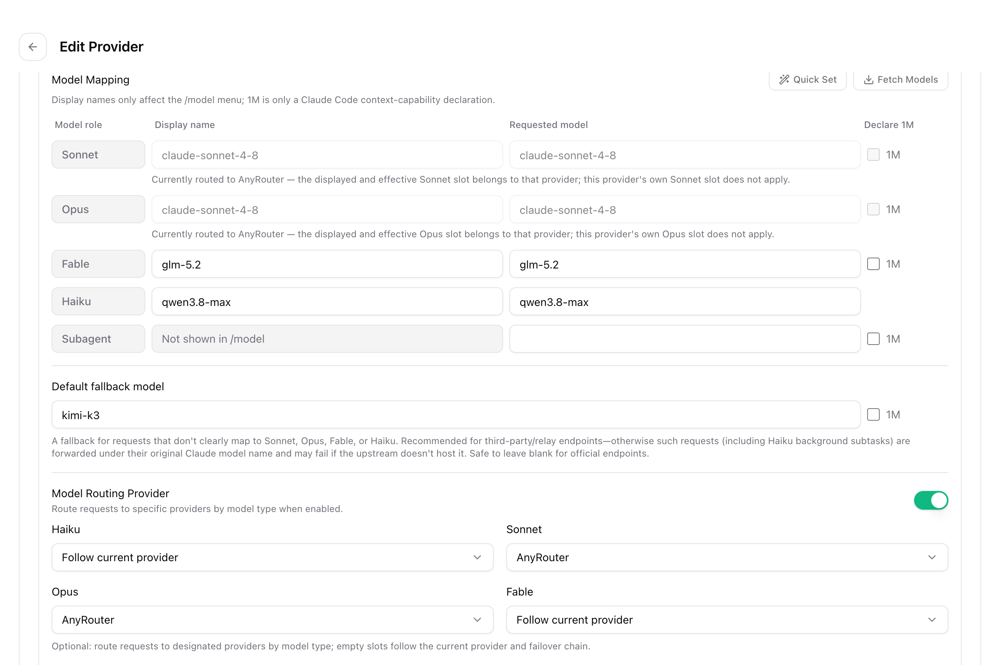
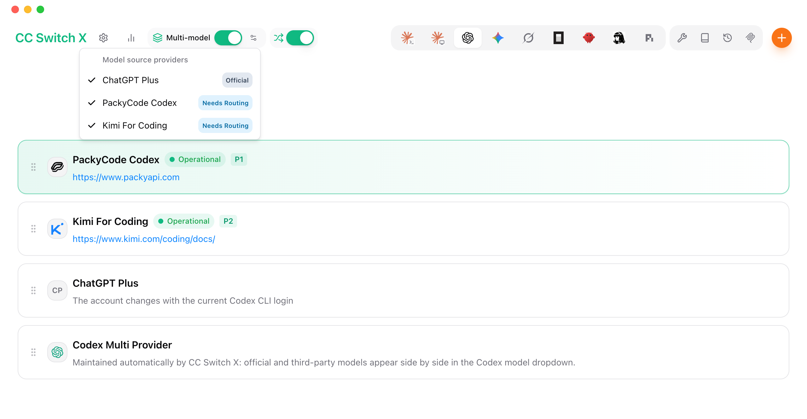
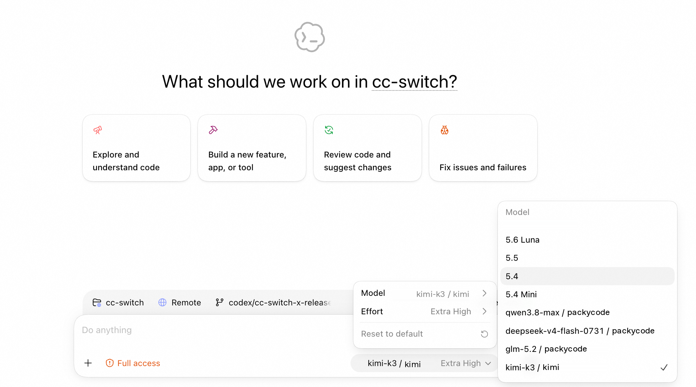

<div align="center">

# CC Switch X

> Inoffizieller Fork von [CC Switch](https://github.com/farion1231/cc-switch). Laufzeitdaten werden isoliert unter `~/.cc-switch-x` gespeichert.

### Multi-Anbieter-Routing und Kompatibilität für Claude und Codex, auf Basis von CC Switch

[](https://github.com/haochen-leo/cc-switch-x/releases)
[](https://github.com/haochen-leo/cc-switch-x/releases)
[](https://tauri.app/)
[](https://github.com/haochen-leo/cc-switch-x/releases/latest)

### Upstream-Projekt: **[CC Switch](https://github.com/farion1231/cc-switch)**

[English](README.md) | [中文](README_ZH.md) | [日本語](README_JA.md) | Deutsch | [Changelog](CHANGELOG.md)

</div>

## Warum CC Switch X?

CC Switch X ist ein fokussierter Fork für Nutzer, die Claude und Codex zuverlässig mit mehreren offiziellen und Drittanbieter-Modellanbietern verwenden möchten. Die Desktop-Verwaltungsbasis von [CC Switch](https://github.com/farion1231/cc-switch) bleibt erhalten; die X-Entwicklung konzentriert sich auf Anbieter-Aggregation, Protokollkompatibilität, Modell-Routing und Robustheit.

- **Claude Multi-Anbieter, pro Modellrolle** — Ordnen Sie jeder Claude-Rolle (Sonnet / Opus / Fable / Haiku) Anzeigenamen und Upstream-Modelle zu und routen Sie verschiedene Rollen an verschiedene Anbieter — zum Beispiel Opus von einem Endpunkt, Hintergrund-Haiku von einem günstigeren.
- **Codex Multi-Anbieter-Aggregation** — Offizielle und Drittanbieter-Codex-Anbieter werden zu einem einzigen Eintrag aggregiert, sodass die Modelle aller Quellen nebeneinander im selben Codex-Modell-Dropdown erscheinen und nahtlos mit den offiziellen Modellen wechseln.
- **Tiefe Responses-API-Adaption** — Codex kommuniziert über die Responses API, deren Semantik (Reasoning-Items, Tool-Call-Wiedergabe, Sitzungszustand, Cache-Verhalten) kaum dokumentiert ist und sich ständig ändert; die meisten Endpunkte mit „OpenAI-Kompatibilität" weichen still davon ab. Beliebige Upstreams unter Codex korrekt zum Laufen zu bringen, ist der Bereich, in den CC Switch X am meisten Adoptionsarbeit investiert hat.
- **Robustheit unter Last** — Automatische Wiederholungen mit Backoff bei 429 / Rate-Limits, Circuit Breaker und eine priorisierte Failover-Warteschlange halten lange Sitzungen am Leben, wenn ein Anbieter schwächelt.

## Screenshots

|                  Claude Modell-Mapping & Routing pro Rolle                  |                Codex Modellquellen-Aggregation                 |
| :-------------------------------------------------------------------------: | :------------------------------------------------------------: |
|  |  |

|                                        Codex Modellauswahl (Desktop-App)                                        |
| :-------------------------------------------------------------------------------------------------------------: |
|  |

## Auf Basis von CC Switch

[Vollständiges Changelog](CHANGELOG.md) | [Release Notes](docs/release-notes/v0.1.0-beta.1-en.md)

CC Switch X übernimmt die umfassenden Desktop-Verwaltungsfunktionen des Upstream-Projekts: Anbieter- und Konfigurationsverwaltung für neun KI-Werkzeuge, MCP / Prompts / Skills, Tray-Umschaltung, Nutzungsverfolgung, Sitzungen, Cloud-Synchronisierung, Import/Export, Backups und plattformübergreifende Unterstützung. Allgemeine Funktionen finden Sie im [Upstream-Projekt](https://github.com/farion1231/cc-switch), Details zur Nutzung im [Benutzerhandbuch](docs/user-manual/en/README.md).

## FAQ

<details>
<summary><strong>Welche KI-Werkzeuge unterstützt CC Switch?</strong></summary>

CC Switch unterstützt neun Werkzeuge: **Claude Code**, **Claude Desktop**, **Codex**, **Gemini CLI**, **Grok Build**, **OpenCode**, **OpenClaw**, **Hermes** und **Pi**. Jedes Werkzeug verfügt über dedizierte Anbieter-Presets und Konfigurationsverwaltung.

</details>

<details>
<summary><strong>Muss ich das Terminal nach einem Anbieterwechsel neu starten?</strong></summary>

Bei den meisten Werkzeugen ja — starten Sie Ihr Terminal oder das CLI-Werkzeug neu, damit die Änderungen wirksam werden. Die Ausnahme ist **Claude Code**, das derzeit das Hot-Switching von Anbieterdaten ohne Neustart unterstützt.

</details>

<details>
<summary><strong>Meine Plugin-Konfiguration ist nach einem Anbieterwechsel verschwunden — was ist passiert?</strong></summary>

CC Switch bietet eine Funktion „Gemeinsames Konfigurations-Snippet", um gemeinsame Daten (über API-Schlüssel und Endpunkte hinaus) zwischen Anbietern weiterzugeben. Gehen Sie zu „Anbieter bearbeiten" → „Panel für gemeinsame Konfiguration" → klicken Sie auf „Aus aktuellem Anbieter extrahieren", um alle gemeinsamen Daten zu speichern. Aktivieren Sie beim Anlegen eines neuen Anbieters die Option „Gemeinsame Konfiguration schreiben" (standardmäßig aktiviert), um die Plugin-Daten in den neuen Anbieter aufzunehmen. Alle Ihre Konfigurationspunkte bleiben im Standardanbieter erhalten, der beim ersten Start der App importiert wurde.

</details>

<details>
<summary><strong>Installation unter macOS</strong></summary>

CC Switch-X-Beta-Builds sind noch nicht mit einem X-spezifischen Apple-Zertifikat signiert oder notarisiert. Laden Sie sie nur von der Releases-Seite dieses Repositorys herunter, prüfen Sie die Quelle und rechnen Sie beim ersten Start mit einer Gatekeeper-Warnung. Wir empfehlen das `.dmg`-Installationsprogramm, sofern verfügbar.

</details>

<details>
<summary><strong>Warum kann ich den aktuell aktiven Anbieter nicht löschen?</strong></summary>

CC Switch folgt dem Designprinzip der „minimalen Eingriffstiefe" — selbst wenn Sie die App deinstallieren, funktionieren Ihre CLI-Werkzeuge weiterhin normal. Das System behält immer eine aktive Konfiguration bei, da das Löschen aller Konfigurationen das entsprechende CLI-Werkzeug unbrauchbar machen würde. Wenn Sie ein bestimmtes CLI-Werkzeug selten verwenden, können Sie es in den Einstellungen ausblenden. Wie Sie zurück zum offiziellen Login wechseln, erfahren Sie in der nächsten Frage.

</details>

<details>
<summary><strong>Wie wechsle ich zurück zum offiziellen Login?</strong></summary>

Fügen Sie einen offiziellen Anbieter aus der Preset-Liste hinzu. Führen Sie nach dem Wechsel den Abmelde-/Anmelde-Vorgang aus; anschließend können Sie frei zwischen dem offiziellen Anbieter und Drittanbietern wechseln. Codex unterstützt den Wechsel zwischen verschiedenen offiziellen Anbietern, was das Umschalten zwischen mehreren Plus- oder Team-Konten erleichtert.

</details>

<details>
<summary><strong>Wo werden meine Daten gespeichert?</strong></summary>

- **Datenbank**: `~/.cc-switch-x/cc-switch.db` (SQLite — Anbieter, MCP, Prompts, Skills)
- **Lokale Einstellungen**: `~/.cc-switch-x/settings.json` (gerätebezogene UI-Einstellungen)
- **Backups**: `~/.cc-switch-x/backups/` (automatisch rotiert, behält die 10 neuesten)
- **Skills**: `~/.cc-switch-x/skills/` (standardmäßig per Symlink mit den entsprechenden Apps verbunden)
- **Skill-Backups**: `~/.cc-switch-x/skill-backups/` (vor der Deinstallation automatisch erstellt, behält die 20 neuesten)

</details>

<details>
<summary><strong>Linux (Wayland + NVIDIA): Klicks im Webinhalt reagieren nicht, schwarzer Bildschirm beim Größenändern</strong></summary>

Das AppImage erzwingt `GDK_BACKEND=x11` (XWayland), um einen historischen nativen Wayland-Absturz zu vermeiden. Auf neueren Wayland-+-NVIDIA-Systemen kann das dazu führen, dass der Webinhalt nicht anklickbar ist (die Titelleisten-Schaltflächen funktionieren weiterhin) und das Fenster beim Größenändern schwarz wird. Starten Sie mit dem optionalen Notausgang, um zu nativem Wayland zu wechseln:

```bash
CC_SWITCH_GDK_BACKEND=wayland ./CC-Switch-*.AppImage
```

Wenn Sie über ein Desktop-Symbol starten, fügen Sie es der `Exec=`-Zeile der `.desktop`-Datei hinzu (z. B. `env CC_SWITCH_GDK_BACKEND=wayland /pfad/zum/AppImage`) oder setzen Sie es in Ihrer Sitzungsumgebung. Die Variable ist generisch: Auf Tiling-Wayland-Compositors (sway/Hyprland), bei denen Klicks nicht reagieren, versuchen Sie umgekehrt `CC_SWITCH_GDK_BACKEND=x11`. Bleibt sie ungesetzt, bleibt das Standardverhalten erhalten.

</details>

## Dokumentation

Ausführliche Anleitungen zu jeder Funktion finden Sie im **[Benutzerhandbuch](docs/user-manual/en/README.md)** — es deckt Anbieterverwaltung, MCP/Prompts/Skills, Proxy & Failover und mehr ab.

## Schnellstart

### Grundlegende Verwendung

1. **Anbieter hinzufügen**: Klicken Sie auf „Add Provider" → Wählen Sie ein Preset oder erstellen Sie eine eigene Konfiguration
2. **Anbieter wechseln**:
   - Hauptoberfläche: Anbieter auswählen → auf „Enable" klicken
   - System-Tray: Anbietername direkt anklicken (sofort wirksam)
3. **Wirksam werden**: Starten Sie Ihr Terminal oder das entsprechende CLI-Werkzeug neu, um die Änderungen anzuwenden (Claude Code erfordert keinen Neustart)
4. **Zurück zum Offiziellen**: Fügen Sie ein „Official Login"-Preset hinzu, starten Sie das CLI-Werkzeug neu und folgen Sie dann seinem Login-/OAuth-Vorgang

### MCP, Prompts, Skills & Sessions

- **MCP**: Klicken Sie auf die Schaltfläche „MCP" → Server über Vorlagen oder eigene Konfiguration hinzufügen → Synchronisierung pro App umschalten
- **Prompts**: Klicken Sie auf „Prompts" → Presets mit dem Markdown-Editor erstellen → Aktivieren, um mit den Live-Dateien zu synchronisieren
- **Skills**: Klicken Sie auf „Skills" → GitHub-Repositorys durchsuchen → mit einem Klick in unterstützte Apps installieren
- **Sessions**: Klicken Sie auf „Sessions" → Gesprächsverlauf aus unterstützten Sitzungsquellen durchsuchen, suchen und wiederherstellen

> **Hinweis**: Beim Erststart können Sie bestehende CLI-Werkzeug-Konfigurationen manuell als Standardanbieter importieren.

## Download & Installation

### Systemanforderungen

- **Windows**: Windows 10 und höher
- **macOS**: macOS 12 (Monterey) und höher
- **Linux**: Ubuntu 22.04+ / Debian 11+ / Fedora 34+ und andere gängige Distributionen

### Windows-Nutzer

Laden Sie das neueste Installationsprogramm `CC-Switch-X-v{version}-Windows.msi` oder die portable Version `CC-Switch-X-v{version}-Windows-Portable.zip` von der Seite [Releases](https://github.com/haochen-leo/cc-switch-x/releases) herunter.

### macOS-Nutzer

**Methode 1: Homebrew**

CC Switch X hat noch kein eigenes Homebrew-Cask. Verwenden Sie den manuellen Download unten oder bauen Sie aus dem Quellcode.

**Methode 2: Manueller Download**

Laden Sie `CC-Switch-X-v{version}-macOS.dmg` (empfohlen) oder `.zip` von der Seite [Releases](https://github.com/haochen-leo/cc-switch-x/releases) herunter.

> **Hinweis**: CC Switch-X-Beta-Builds sind noch nicht signiert oder notarisiert. Prüfen Sie die Download-Quelle und rechnen Sie mit einer Gatekeeper-Warnung.

### Arch-Linux-Nutzer

CC Switch X hat noch kein eigenes AUR-Paket. Das Upstream-Paket `cc-switch-bin` installiert das offizielle CC Switch, nicht CC Switch X.

### Linux-Nutzer

Laden Sie den neuesten Linux-Build von der Seite [Releases](https://github.com/haochen-leo/cc-switch-x/releases) herunter:

- `CC-Switch-X-v{version}-Linux-x86_64.deb` (Debian/Ubuntu)
- `CC-Switch-X-v{version}-Linux-x86_64.rpm` (Fedora/RHEL/openSUSE)
- `CC-Switch-X-v{version}-Linux-x86_64.AppImage` (universell)

> **Flatpak**: Nicht in den offiziellen Releases enthalten. Sie können es selbst aus dem `.deb` bauen — eine Anleitung finden Sie unter [`flatpak/README.md`](flatpak/README.md).

<details>
<summary><strong>Architekturüberblick</strong></summary>

### Designprinzipien

```
┌─────────────────────────────────────────────────────────────┐
│                    Frontend (React + TS)                    │
│  ┌─────────────┐  ┌──────────────┐  ┌──────────────────┐    │
│  │ Components  │  │    Hooks     │  │  TanStack Query  │    │
│  │   (UI)      │──│ (Bus. Logic) │──│   (Cache/Sync)   │    │
│  └─────────────┘  └──────────────┘  └──────────────────┘    │
└────────────────────────┬────────────────────────────────────┘
                         │ Tauri IPC
┌────────────────────────▼────────────────────────────────────┐
│                  Backend (Tauri + Rust)                     │
│  ┌─────────────┐  ┌──────────────┐  ┌──────────────────┐    │
│  │  Commands   │  │   Services   │  │  Models/Config   │    │
│  │ (API Layer) │──│ (Bus. Layer) │──│     (Data)       │    │
│  └─────────────┘  └──────────────┘  └──────────────────┘    │
└─────────────────────────────────────────────────────────────┘
```

**Kern-Designmuster**

- **SSOT** (Single Source of Truth): Alle Daten werden in `~/.cc-switch-x/cc-switch.db` (SQLite) gespeichert
- **Zweischichtiger Speicher**: SQLite für synchronisierbare Daten, JSON für gerätebezogene Einstellungen
- **Bidirektionale Synchronisierung**: Schreiben in Live-Dateien beim Umschalten, Backfill aus den Live-Dateien beim Bearbeiten des aktiven Anbieters
- **Atomare Schreibvorgänge**: Das Muster aus temporärer Datei + Umbenennen verhindert die Beschädigung von Konfigurationen
- **Nebenläufigkeitssicher**: Eine durch Mutex geschützte Datenbankverbindung vermeidet Race Conditions
- **Geschichtete Architektur**: Klare Trennung (Commands → Services → DAO → Database)

**Schlüsselkomponenten**

- **ProviderService**: Anbieter-CRUD, Umschaltung, Backfill, Sortierung
- **McpService**: Verwaltung von MCP-Servern, Import/Export, Synchronisierung von Live-Dateien
- **ProxyService**: Lokaler Proxy-Modus mit Hot-Switching und Formatkonvertierung
- **SessionManager**: Durchsuchen des Gesprächsverlaufs über alle unterstützten Apps hinweg
- **ConfigService**: Konfigurations-Import/-Export, Backup-Rotation
- **SpeedtestService**: Messung der Latenz von API-Endpunkten

</details>

<details>
<summary><strong>Entwicklungsleitfaden</strong></summary>

### Umgebungsanforderungen

- Node.js 18+
- pnpm 8+
- Rust 1.85+
- Tauri CLI 2.8+

### Entwicklungsbefehle

```bash
# Abhängigkeiten installieren
pnpm install

# Entwicklungsmodus (Hot Reload)
pnpm dev

# Typprüfung
pnpm typecheck

# Code formatieren
pnpm format

# Codeformatierung prüfen
pnpm format:check

# Frontend-Unit-Tests ausführen
pnpm test:unit

# Tests im Watch-Modus ausführen (für die Entwicklung empfohlen)
pnpm test:unit:watch

# Anwendung bauen
pnpm build

# Debug-Version bauen
pnpm tauri build --debug
```

### Entwicklung des Rust-Backends

```bash
cd src-tauri

# Rust-Code formatieren
cargo fmt

# Clippy-Prüfungen ausführen
cargo clippy

# Backend-Tests ausführen
cargo test

# Bestimmte Tests ausführen
cargo test test_name

# Tests mit dem Feature test-hooks ausführen
cargo test --features test-hooks
```

### Testleitfaden

**Frontend-Tests**:

- Verwendet **vitest** als Test-Framework
- Verwendet **MSW (Mock Service Worker)**, um Tauri-API-Aufrufe zu mocken
- Verwendet **@testing-library/react** für Komponententests

**Tests ausführen**:

```bash
# Alle Tests ausführen
pnpm test:unit

# Watch-Modus (automatische erneute Ausführung)
pnpm test:unit:watch

# Mit Coverage-Bericht
pnpm test:unit --coverage
```

### Tech-Stack

**Frontend**: React 18 · TypeScript · Vite · TailwindCSS 3.4 · TanStack Query v5 · react-i18next · react-hook-form · zod · shadcn/ui · @dnd-kit

**Backend**: Tauri 2.8 · Rust · serde · tokio · thiserror · tauri-plugin-updater/process/dialog/store/log

**Testing**: vitest · MSW · @testing-library/react

</details>

<details>
<summary><strong>Projektstruktur</strong></summary>

```
├── src/                        # Frontend (React + TypeScript)
│   ├── components/
│   │   ├── providers/          # Anbieterverwaltung
│   │   ├── mcp/                # MCP-Panel
│   │   ├── prompts/            # Prompts-Verwaltung
│   │   ├── skills/             # Skills-Verwaltung
│   │   ├── sessions/           # Session Manager
│   │   ├── proxy/              # Proxy-Modus-Panel
│   │   ├── openclaw/           # OpenClaw-Konfigurationspanels
│   │   ├── settings/           # Einstellungen (Terminal/Backup/About)
│   │   ├── deeplink/           # Deep-Link-Import
│   │   ├── env/                # Verwaltung von Umgebungsvariablen
│   │   ├── universal/          # App-übergreifende Konfiguration
│   │   ├── usage/              # Nutzungsstatistik
│   │   └── ui/                 # shadcn/ui-Komponentenbibliothek
│   ├── hooks/                  # Eigene Hooks (Geschäftslogik)
│   ├── lib/
│   │   ├── api/                # Tauri-API-Wrapper (typsicher)
│   │   └── query/              # TanStack-Query-Konfiguration
│   ├── locales/                # Übersetzungen (zh/zh-TW/en/ja)
│   ├── config/                 # Presets (providers/mcp)
│   └── types/                  # TypeScript-Definitionen
├── src-tauri/                  # Backend (Rust)
│   └── src/
│       ├── commands/           # Tauri-Befehlsschicht (nach Domäne)
│       ├── services/           # Geschäftslogikschicht
│       ├── database/           # SQLite-DAO-Schicht
│       ├── proxy/              # Proxy-Modul
│       ├── session_manager/    # Sitzungsverwaltung
│       ├── deeplink/           # Deep-Link-Verarbeitung
│       └── mcp/                # MCP-Synchronisierungsmodul
├── tests/                      # Frontend-Tests
└── assets/                     # Screenshots & Partnerressourcen
```

</details>

## Mitwirken

Issues und Vorschläge sind willkommen!

Bitte stellen Sie vor dem Einreichen von PRs Folgendes sicher:

- Typprüfung besteht: `pnpm typecheck`
- Formatprüfung besteht: `pnpm format:check`
- Unit-Tests bestehen: `pnpm test:unit`

Eröffnen Sie für neue Funktionen bitte vor dem Einreichen eines PR ein Issue zur Diskussion. PRs für Funktionen, die nicht gut zum Projekt passen, können geschlossen werden.

## Star History

[](https://www.star-history.com/#haochen-leo/cc-switch-x&Date)

## Lizenz

MIT © Jason Young; CC Switch X-Erweiterungen © haochen-leo
